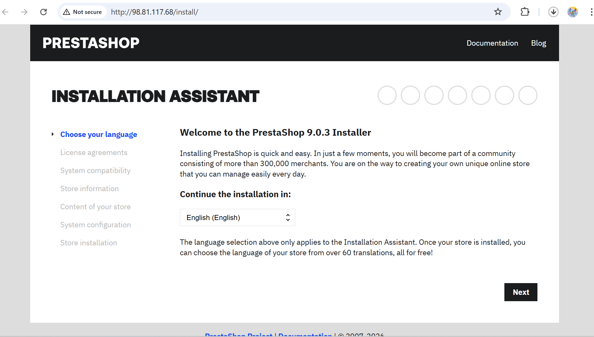
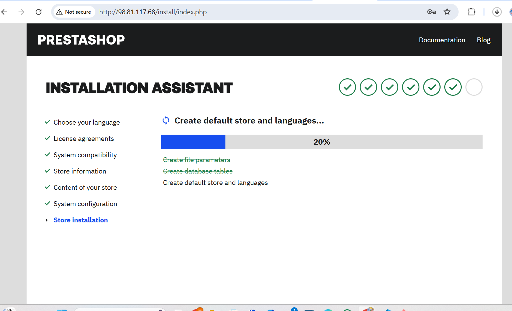
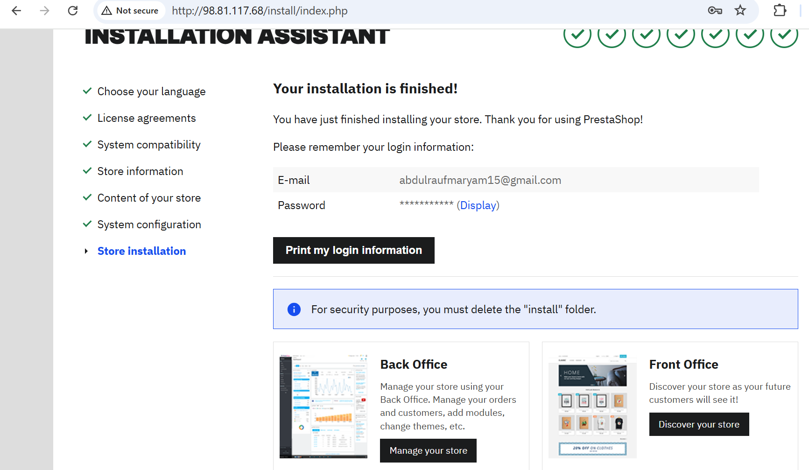

# Deployment of PrestaShop on AWS 

This document outlines the deployment of PrestaShop on AWS using Terraform. The application is hosted on a t2.micro EC2 instance with a separate RDS MySQL database, following AWS Free-Tier constraints.

## Aims

* Publicly accessible PrestaShop store.

* Database hosted separately for security.

* Free-tier AWS resources only.

## Environment setup and provider configuration

1. Created a project folder and initialized Terraform, `terraform init`.

2. Defined the following AWS resources in `main.tf`:

* **VPC** with public subnets.

* **EC2** instance (t2.micro) for PrestaShop.

* RDS **MySQL** database for application data.

* Security groups:

  * **EC2 SG:** Allow SSH (22) and HTTP (80).

  * **RDS SG:** Allow MySQL (3306) only from the EC2 SG.

* **Internet Gateway** and Route Tables for public access.

3. Defined my `provider.tf`, `variables.tf`, `output.tf`, and `script.sh`. In my `provider.tf` is where the provider I want to use, which is AWS is defined. The values I don't want exposed were put in my `variables.tf` and `output.tf` is where I put the values I want Terraform to display for me without needing to click through the AWS console.

4. Applied Terraform:

```
terraform plan
terraform apply --auto-approve
```

5. Recorded outputs:

EC2 public IP: 98.81.117.68

RDS endpoint: `terraform-20260211100738749300000001.c4hycg8uaqla.us-east-1.rds.amazonaws.com`

Website URL: http://98.81.117.68


## Security group configurations

Two security groups were created to enforce the principle of least privilege:

1. Web security group (EC2):

* **Inbound:** Port 80 (HTTP) and Port 22 (SSH) allowed from 0.0.0.0/0.

2. Database security group (RDS):

* **Inbound:** Port 3306 (MySQL) allowed only from the Web security group ID.

* **Public access:** Explicitly disabled to protect sensitive data.


## Database and application server deployment

### RDS MySQL instance

Provisioned a managed `db.t3.micro` MySQL instance.

* **Storage:** 20 GB General Purpose SSD.

* **Security:** Placed in a private DB subnet group with publicly_accessible = false.


### Verification and final output

Once terraform apply --auto-approve completed, the application was verified through the browser and the AWS Console.

**Instance details**:

* Instance type: `t2.micro`

* Status: *Running*


## Terraform State Verification

After deploying the infrastructure, I verified the created AWS resources using Terraform state.
```bash
terraform state list
```
This command confirmed that all required resources were successfully created and managed by Terraform.


## Key resources in AWS 

The following are the resources that are created in the AWS:
|Resource |	Value/Configuration|
|---|---|
|EC2 Instance Type|	t2.micro|
|AMI Used|Ubuntu 22.04 LTS (or your chosen AMI)|
|Public URL|	http://98.81.117.68 |
|RDS Engine	|MySQL 8.0|
|Storage	| 20 GB, Free-Tier|
|Security Groups	| EC2: SSH/HTTP, RDS: MySQL from EC2 only


## PrestaShop Installation

1. Opened the public URL in a browser: http://98.81.117.68

2. Completed the PrestaShop setup wizard:

3. Entered RDS database details.

* Set admin account credentials.

* Configured store settings (language, currency, theme).

4. During the PrestaShop installation, the setup reported missing server requirements. Precisely, Apache mod_rewrite and the PHP extension were required for proper functionality.
I enabled the required Apache module and restarted the service on the ec2 server:
```bash
sudo a2enmod rewrite
sudo systemctl restart apache2
```

## Verified installation.










## Gif showing the Prestashop running


This project was a fantastic success! It shows how powerful Terraform can be for creating a production environment in minutes. By keeping the database separated from the public internet and only allowing the web server to talk to it, Happy cloud engineering!
